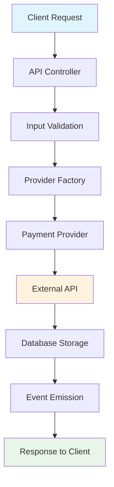
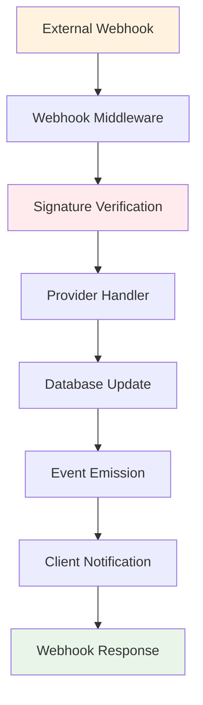
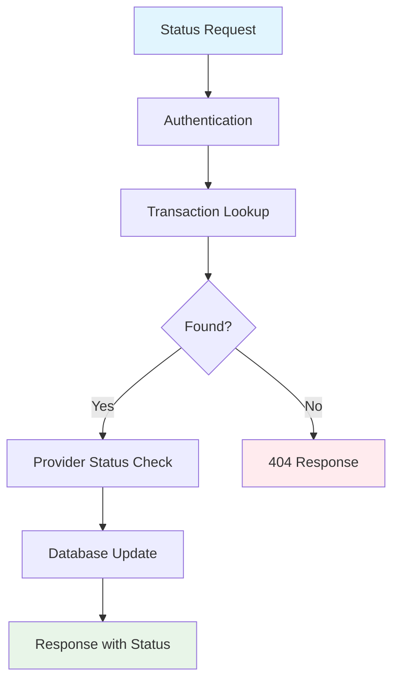
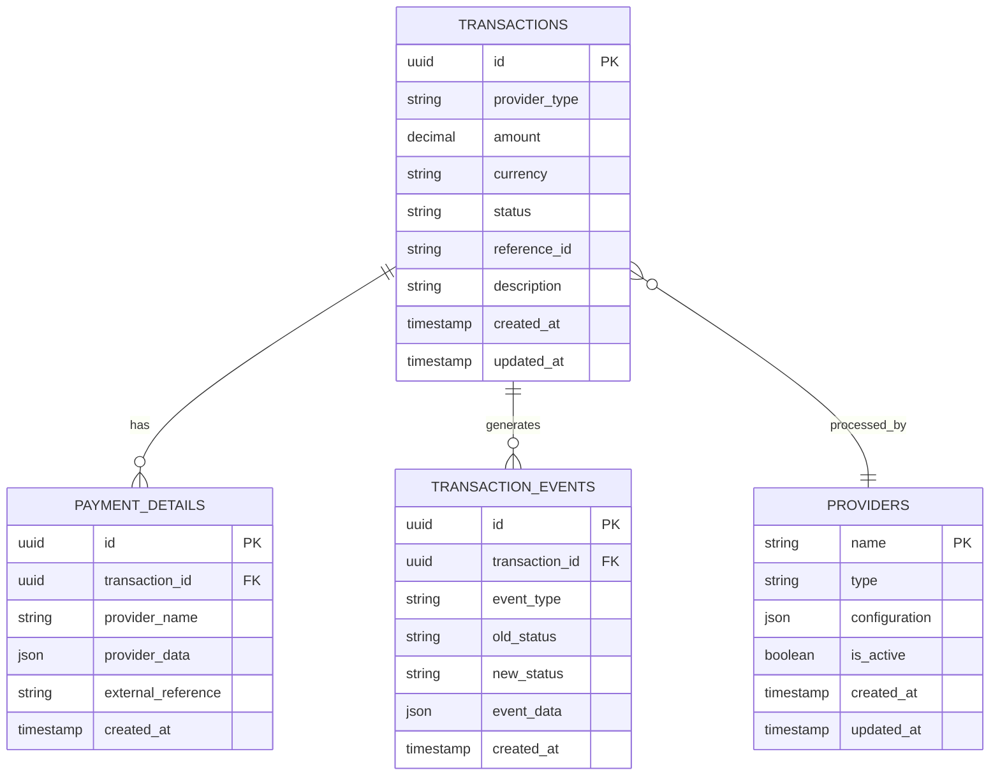

# Payment Module Architecture

## 🏗️ **System Architecture Overview**

This document outlines the architectural decisions, design patterns, and technical considerations for the standalone payment processing module.

## 📋 **Table of Contents**
1. [Architecture Principles](#architecture-principles)
2. [System Components](#system-components)
3. [Data Flow](#data-flow)
4. [Design Patterns](#design-patterns)
5. [Database Design](#database-design)
6. [Security Architecture](#security-architecture)
7. [Scalability Considerations](#scalability-considerations)
8. [Integration Patterns](#integration-patterns)

## 🎯 **Architecture Principles**

### **1. Separation of Concerns**
Each component has a single, well-defined responsibility:
- **Providers**: Handle payment-specific logic
- **API Layer**: Manage HTTP communication
- **Database Layer**: Persist and retrieve data
- **Event System**: Handle asynchronous notifications

### **2. Provider Abstraction**
All payment providers implement a common interface, enabling:
- Easy addition of new providers
- Consistent behavior across providers
- Provider-agnostic client code

### **3. Event-Driven Architecture**
Asynchronous processing through events:
- Decoupled components
- Reliable payment status updates
- Extensible notification system

### **4. Configuration-Based Design**
Runtime behavior controlled through configuration:
- Environment-specific settings
- Feature toggles
- Provider-specific parameters

## 🧩 **System Components**

### **Component Diagram**
```
┌─────────────────────────────────────────────────────────────────┐
│                        Payment Module                           │
├─────────────────────────────────────────────────────────────────┤
│                                                                 │
│  ┌─────────────────┐    ┌─────────────────┐    ┌─────────────┐  │
│  │   API Layer     │    │  Event System   │    │   Config    │  │
│  │                 │    │                 │    │  Manager    │  │
│  │ • Routes        │    │ • Event Emitter │    │             │  │
│  │ • Controllers   │    │ • Handlers      │    │ • Env Vars  │  │
│  │ • Middleware    │    │ • Notifications │    │ • Validation│  │
│  └─────────────────┘    └─────────────────┘    └─────────────┘  │
│           │                       │                      │       │
│  ┌─────────────────┐    ┌─────────────────┐    ┌─────────────┐  │
│  │   Providers     │    │  Database       │    │   Utils     │  │
│  │                 │    │                 │    │             │  │
│  │ • M-Pesa        │    │ • Models        │    │ • Validators│  │
│  │ • Stripe (TODO) │    │ • Migrations    │    │ • Formatters│  │
│  │ • PayPal (TODO) │    │ • Connection    │    │ • Helpers   │  │
│  │ • Interface     │    │ • Transactions  │    │             │  │
│  └─────────────────┘    └─────────────────┘    └─────────────┘  │
│                                                                 │
└─────────────────────────────────────────────────────────────────┘
```

### **1. API Layer**
**Purpose**: Handle HTTP requests and responses
**Components**:
- **Routes**: Define endpoint mappings
- **Controllers**: Process business logic
- **Middleware**: Authentication, validation, logging

**Responsibilities**:
- Request/response handling
- Input validation
- Authentication/authorization
- Error handling and formatting

### **2. Provider Layer**
**Purpose**: Implement payment-specific logic
**Components**:
- **Provider Interface**: Common contract
- **M-Pesa Provider**: Safaricom M-Pesa implementation
- **Provider Factory**: Instantiate providers

**Responsibilities**:
- Payment initiation
- Status checking
- Webhook processing
- Provider-specific formatting

### **3. Database Layer**
**Purpose**: Data persistence and retrieval
**Components**:
- **Connection Manager**: Database connectivity
- **Models**: Data structures
- **Migrations**: Schema management

**Responsibilities**:
- Transaction storage
- Data integrity
- Query optimization
- Schema evolution

### **4. Event System**
**Purpose**: Asynchronous communication
**Components**:
- **Event Emitter**: Core event handling
- **Event Handlers**: Process specific events
- **Notification System**: External notifications

**Responsibilities**:
- Payment status changes
- Webhook notifications
- External system integration
- Audit trail creation

## 🔄 **Data Flow Architecture**

### **1. Payment Initiation Flow**


### **2. Webhook Processing Flow**


### **3. Status Query Flow**


## 🎨 **Design Patterns**

### **1. Strategy Pattern**
**Usage**: Payment Provider Selection
```javascript
// Provider interface defines common methods
class PaymentProvider {
  async initiatePayment(paymentData) {}
  async checkStatus(transactionId) {}
  async processCallback(callbackData) {}
}

// Concrete implementations
class MpesaProvider extends PaymentProvider {
  async initiatePayment(paymentData) {
    // M-Pesa specific implementation
  }
}

class StripeProvider extends PaymentProvider {
  async initiatePayment(paymentData) {
    // Stripe specific implementation
  }
}
```

### **2. Factory Pattern**
**Usage**: Provider Instantiation
```javascript
class ProviderFactory {
  static createProvider(providerType, config) {
    switch (providerType) {
      case 'mpesa':
        return new MpesaProvider(config.mpesa);
      case 'stripe':
        return new StripeProvider(config.stripe);
      default:
        throw new Error(`Unknown provider: ${providerType}`);
    }
  }
}
```

### **3. Observer Pattern**
**Usage**: Event System
```javascript
class PaymentEventEmitter extends EventEmitter {
  emitPaymentInitiated(paymentData) {
    this.emit('payment.initiated', paymentData);
  }

  emitPaymentCompleted(paymentData) {
    this.emit('payment.completed', paymentData);
  }
}

// Handlers subscribe to events
eventEmitter.on('payment.completed', (data) => {
  // Send notification, update analytics, etc.
});
```

### **4. Repository Pattern**
**Usage**: Database Access
```javascript
class TransactionRepository {
  async create(transactionData) {
    // Database insert logic
  }

  async findById(id) {
    // Database query logic
  }

  async updateStatus(id, status) {
    // Database update logic
  }
}
```

## 🗄️ **Database Design**

### **Entity Relationship Diagram**


### **Table Definitions**

#### **transactions**
Primary transaction record with provider-agnostic fields
```sql
CREATE TABLE transactions (
  id UUID PRIMARY KEY DEFAULT gen_random_uuid(),
  provider_type VARCHAR(50) NOT NULL,
  amount DECIMAL(12,2) NOT NULL,
  currency VARCHAR(3) DEFAULT 'KES',
  status VARCHAR(20) NOT NULL DEFAULT 'initiated',
  reference_id VARCHAR(255) UNIQUE NOT NULL,
  description TEXT,
  metadata JSONB,
  created_at TIMESTAMP DEFAULT CURRENT_TIMESTAMP,
  updated_at TIMESTAMP DEFAULT CURRENT_TIMESTAMP,

  -- Indexes for performance
  INDEX idx_transactions_status (status),
  INDEX idx_transactions_provider (provider_type),
  INDEX idx_transactions_reference (reference_id),
  INDEX idx_transactions_created (created_at)
);
```

#### **payment_details**
Provider-specific payment information
```sql
CREATE TABLE payment_details (
  id UUID PRIMARY KEY DEFAULT gen_random_uuid(),
  transaction_id UUID REFERENCES transactions(id) ON DELETE CASCADE,
  provider_name VARCHAR(50) NOT NULL,
  provider_data JSONB NOT NULL,
  external_reference VARCHAR(255),
  callback_data JSONB,
  created_at TIMESTAMP DEFAULT CURRENT_TIMESTAMP,
  updated_at TIMESTAMP DEFAULT CURRENT_TIMESTAMP,

  -- Unique constraint to prevent duplicates
  UNIQUE(transaction_id, provider_name)
);
```

#### **transaction_events**
Audit trail for all transaction changes
```sql
CREATE TABLE transaction_events (
  id UUID PRIMARY KEY DEFAULT gen_random_uuid(),
  transaction_id UUID REFERENCES transactions(id) ON DELETE CASCADE,
  event_type VARCHAR(50) NOT NULL,
  old_status VARCHAR(20),
  new_status VARCHAR(20),
  event_data JSONB,
  created_at TIMESTAMP DEFAULT CURRENT_TIMESTAMP,

  -- Index for querying events by transaction
  INDEX idx_events_transaction (transaction_id),
  INDEX idx_events_type (event_type),
  INDEX idx_events_created (created_at)
);
```

### **Data Normalization Strategy**
- **3rd Normal Form**: Eliminate redundant data
- **Provider-Specific Data**: Store in JSONB for flexibility
- **Audit Trail**: Complete transaction history
- **Soft Deletes**: Maintain data integrity for compliance

## 🔐 **Security Architecture**

### **Authentication & Authorization**

#### **API Authentication**
```javascript
// JWT-based authentication
const authMiddleware = (req, res, next) => {
  const token = req.headers.authorization?.split(' ')[1];

  if (!token) {
    return res.status(401).json({ error: 'No token provided' });
  }

  try {
    const decoded = jwt.verify(token, process.env.JWT_SECRET);
    req.user = decoded;
    next();
  } catch (error) {
    return res.status(401).json({ error: 'Invalid token' });
  }
};
```

#### **Role-Based Access Control**
```javascript
const roles = {
  ADMIN: ['read', 'write', 'delete'],
  USER: ['read', 'write'],
  VIEWER: ['read']
};

const authorize = (requiredPermission) => {
  return (req, res, next) => {
    const userRole = req.user.role;
    const permissions = roles[userRole];

    if (!permissions.includes(requiredPermission)) {
      return res.status(403).json({ error: 'Insufficient permissions' });
    }

    next();
  };
};
```

### **Data Protection**

#### **Sensitive Data Encryption**
```javascript
const crypto = require('crypto');

class DataEncryption {
  static encrypt(text, key = process.env.ENCRYPTION_KEY) {
    const cipher = crypto.createCipher('aes-256-gcm', key);
    let encrypted = cipher.update(text, 'utf8', 'hex');
    encrypted += cipher.final('hex');
    return encrypted;
  }

  static decrypt(encryptedText, key = process.env.ENCRYPTION_KEY) {
    const decipher = crypto.createDecipher('aes-256-gcm', key);
    let decrypted = decipher.update(encryptedText, 'hex', 'utf8');
    decrypted += decipher.final('utf8');
    return decrypted;
  }
}
```

#### **Input Validation & Sanitization**
```javascript
const { body, validationResult } = require('express-validator');

const paymentValidation = [
  body('amount')
    .isFloat({ min: 0.01 })
    .withMessage('Amount must be greater than 0'),
  body('phoneNumber')
    .matches(/^254\d{9}$/)
    .withMessage('Phone number must be in format 254XXXXXXXXX'),
  body('reference')
    .isLength({ min: 1, max: 50 })
    .withMessage('Reference is required')
];
```

### **Webhook Security**

#### **Signature Verification**
```javascript
const verifyWebhookSignature = (req, res, next) => {
  const signature = req.headers['x-signature'];
  const payload = JSON.stringify(req.body);
  const secret = process.env.WEBHOOK_SECRET;

  const expectedSignature = crypto
    .createHmac('sha256', secret)
    .update(payload)
    .digest('hex');

  if (signature !== expectedSignature) {
    return res.status(401).json({ error: 'Invalid signature' });
  }

  next();
};
```

## ⚡ **Scalability Considerations**

### **Horizontal Scaling**
- **Stateless Design**: No server-side sessions
- **Database Connection Pooling**: Efficient resource usage
- **Load Balancer Ready**: Multiple instance support

### **Vertical Scaling**
- **Asynchronous Processing**: Non-blocking operations
- **Database Optimization**: Indexed queries
- **Memory Management**: Efficient data structures

### **Caching Strategy**
```javascript
const Redis = require('redis');
const client = Redis.createClient();

class CacheManager {
  static async get(key) {
    const cached = await client.get(key);
    return cached ? JSON.parse(cached) : null;
  }

  static async set(key, data, ttl = 3600) {
    await client.setex(key, ttl, JSON.stringify(data));
  }

  static async invalidate(pattern) {
    const keys = await client.keys(pattern);
    if (keys.length > 0) {
      await client.del(keys);
    }
  }
}
```

### **Database Scaling**
- **Read Replicas**: Separate read/write operations
- **Connection Pooling**: Reuse database connections
- **Query Optimization**: Efficient indexes and queries
- **Partitioning**: Distribute data across multiple tables

## 🔌 **Integration Patterns**

### **1. Direct Integration**
```javascript
const PaymentModule = require('./payment-module');

const paymentService = new PaymentModule(config);
const result = await paymentService.initiatePayment(paymentData);
```

### **2. Microservice Integration**
```javascript
const axios = require('axios');

class PaymentClient {
  constructor(baseUrl, apiKey) {
    this.baseUrl = baseUrl;
    this.apiKey = apiKey;
  }

  async initiatePayment(paymentData) {
    const response = await axios.post(
      `${this.baseUrl}/api/payments/initiate`,
      paymentData,
      {
        headers: {
          'Authorization': `Bearer ${this.apiKey}`,
          'Content-Type': 'application/json'
        }
      }
    );

    return response.data;
  }
}
```

### **3. Event-Driven Integration**
```javascript
// Publisher (Payment Module)
eventEmitter.emit('payment.completed', {
  transactionId: 'txn_123',
  amount: 1000,
  status: 'completed'
});

// Subscriber (Main Application)
paymentEvents.on('payment.completed', (data) => {
  // Update user balance
  // Send notification
  // Update analytics
});
```

## 📊 **Performance Considerations**

### **Response Time Targets**
- **API Endpoints**: < 200ms for 95th percentile
- **Database Queries**: < 50ms for simple queries
- **External API Calls**: < 5s with timeout handling

### **Throughput Targets**
- **Concurrent Payments**: 1000+ simultaneous transactions
- **API Requests**: 10,000+ requests per minute
- **Database Operations**: 5000+ queries per second

### **Resource Optimization**
- **Memory Usage**: < 512MB per instance
- **CPU Usage**: < 70% under normal load
- **Database Connections**: Pool size 20-50 connections

## 🏗️ **Deployment Architecture**

### **Container Strategy**
```dockerfile
# Multi-stage build for optimization
FROM node:16-alpine AS builder
WORKDIR /app
COPY package*.json ./
RUN npm ci --only=production

FROM node:16-alpine AS runtime
WORKDIR /app
COPY --from=builder /app/node_modules ./node_modules
COPY src ./src
EXPOSE 3001

# Health check
HEALTHCHECK --interval=30s --timeout=3s --start-period=5s --retries=3 \
  CMD node healthcheck.js

CMD ["node", "src/server.js"]
```

### **Kubernetes Deployment**
```yaml
apiVersion: apps/v1
kind: Deployment
metadata:
  name: payment-service
spec:
  replicas: 3
  strategy:
    type: RollingUpdate
    rollingUpdate:
      maxUnavailable: 1
      maxSurge: 1
  template:
    spec:
      containers:
      - name: payment-service
        image: payment-service:latest
        resources:
          requests:
            memory: "256Mi"
            cpu: "250m"
          limits:
            memory: "512Mi"
            cpu: "500m"
        livenessProbe:
          httpGet:
            path: /health
            port: 3001
          initialDelaySeconds: 30
          periodSeconds: 10
        readinessProbe:
          httpGet:
            path: /health
            port: 3001
          initialDelaySeconds: 5
          periodSeconds: 5
```

## 📈 **Monitoring & Observability**

### **Metrics Collection**
- **Business Metrics**: Transaction success rates, payment volumes
- **Technical Metrics**: Response times, error rates, throughput
- **Infrastructure Metrics**: CPU, memory, network usage

### **Logging Strategy**
- **Structured Logging**: JSON format for machine parsing
- **Log Levels**: ERROR, WARN, INFO, DEBUG
- **Correlation IDs**: Track requests across services

### **Alerting Rules**
- **Critical**: Payment failures > 5%, Service downtime
- **Warning**: High latency > 1s, Unusual error patterns
- **Info**: Deployment notifications, Configuration changes

---

## 🤝 **Architecture Decision Records (ADRs)**

### **ADR-001: Provider Abstraction Pattern**
**Status**: Accepted
**Context**: Need to support multiple payment providers
**Decision**: Implement Strategy pattern with common interface
**Consequences**: Easy to add providers, consistent behavior

### **ADR-002: Event-Driven Architecture**
**Status**: Accepted
**Context**: Need asynchronous processing and notifications
**Decision**: Use EventEmitter for internal events
**Consequences**: Decoupled components, scalable notifications

### **ADR-003: Database Schema Design**
**Status**: Accepted
**Context**: Balance between normalization and performance
**Decision**: Use JSONB for provider-specific data
**Consequences**: Flexible schema, good query performance

This architecture provides a solid foundation for a scalable, maintainable, and secure payment processing system that can grow with business needs while maintaining high performance and reliability.